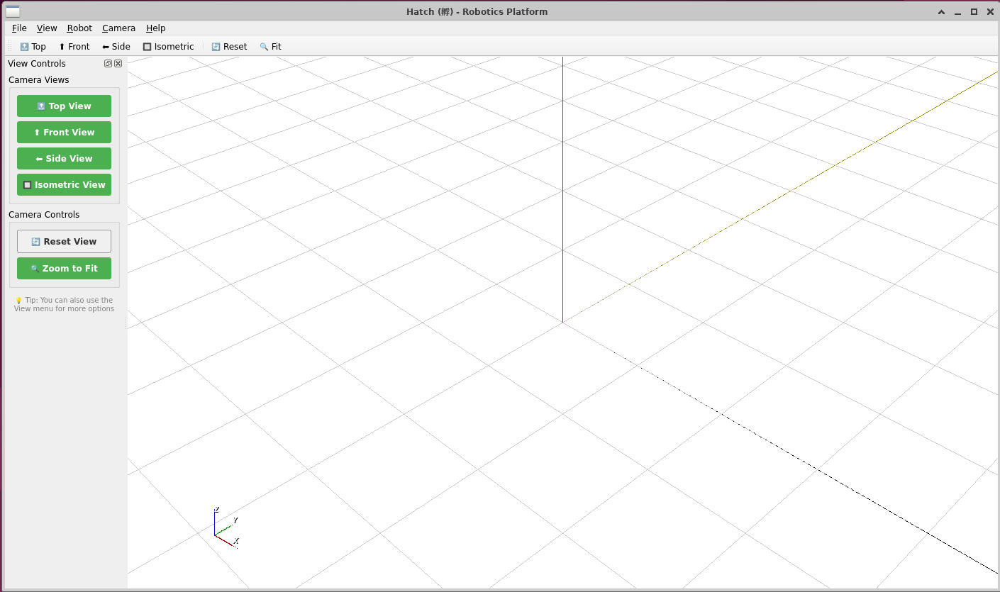
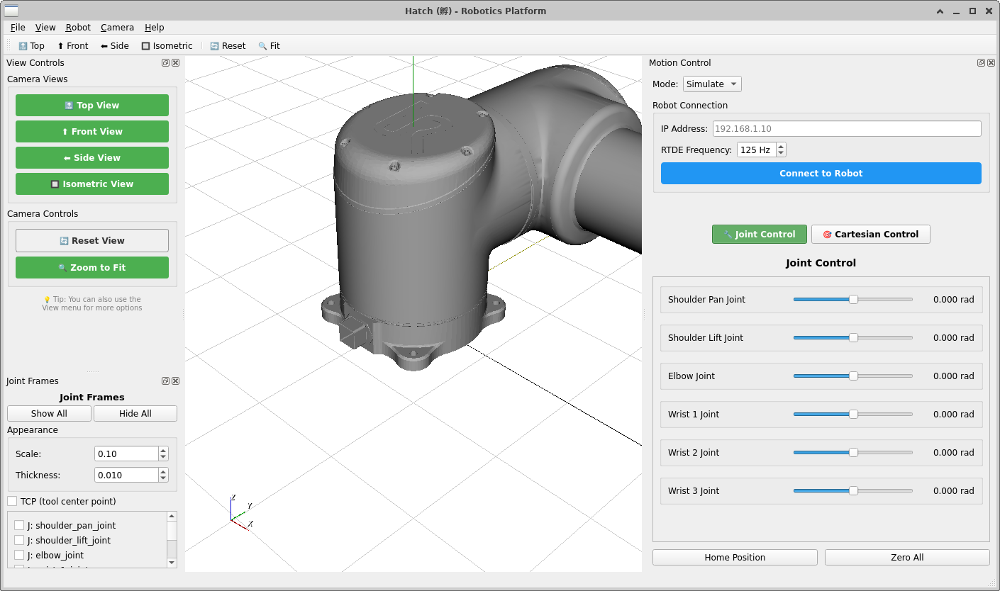

# Getting Started with Hatch

**Time:** 30 minutes  
**Goal:** Load a robot, move it, and understand what you see.

---

## Before You Start

### What You Need

- A computer running Linux (Ubuntu 20.04+ recommended), Windows, or macOS
- Python 3.10 or higher
- A URDF or XACRO file for your robot (or use the example in `assets/robots/`)

### What You Will Learn

- How to start Hatch
- How to load a robot from its URDF
- How to move the robot in joint space and Cartesian space
- How to read the 3D view
- How to switch between simulation and real hardware

---

## Step 1: Install Hatch (5 minutes)

```bash
# Clone the repository
git clone https://github.com/victorwu-robotics/hatch.git
cd hatch

# Create a virtual environment
python -m venv venv
source venv/bin/activate  # On Windows: venv\Scripts\activate

# Install dependencies
pip install -r requirements.txt
```

---

## Step 2: Start Hatch (2 minutes)

```bash
python -m ui.main_window
```

You will see:



- A **3D viewport** with a grid floor (empty, no robot yet)
- A **View Controls** panel on the left (camera presets)
- A **menu bar** at the top (File, View, Robot, Camera, Help)

> **What you see:** The grid is your workspace. The axes in the corner show orientation (red = X, green = Y, blue = Z). The viewport is ready for your robot.

---

## Step 3: Load Your Robot (5 minutes)

**File → Load URDF**

Select your robot's URDF or XACRO file. For example:
- `assets/robots/ur_description/urdf/ur10_nominal.urdf`
- `assets/robots/ur10/ur10.xacro` (Hatch expands this automatically)

After loading:



**What appears:**
- The robot model in the 3D viewport
- The **Motion Control** panel on the right
- The **Joint Control** tab active by default

> **Note:** If the robot appears too large or only partially visible (as in the screenshot above), the **Viewing Camera** is simply zoomed in too close. The robot is fully loaded.

## Adjust the Viewing Camera

| Button | Action |
|--------|--------|
| Zoom to Fit (left panel, Camera Controls) | Frames all objects in the view |
| Reset (toolbar) | Returns camera to default position |
| Scroll wheel | Zoom in/out |
| Left-click drag | Rotate camera around the scene |
| Middle-click drag | Pan the view |

**Try this:** Click **Zoom to Fit** to see the entire robot.

## What You See After Adjusting
- The **full robot arm** from base to tool
- The **grid floor** for spatial reference
- The **world axes** in the corner (red = X, green = Y, blue = Z)

> **What you learn:** The 3D view is a camera looking at the scene. You control the **Viewing Camera**, not the robot. The robot's state is shown; the camera's position is yours to adjust.


---

## Step 4: Move the Robot in Joint Space (5 minutes)

In the **Joint Control** tab:

| Control | What It Does |
|---------|-------------|
| **Shoulder Pan Joint** | Rotates the base of the arm left/right |
| **Shoulder Lift Joint** | Lifts the upper arm up/down |
| **Elbow Joint** | Bends the elbow |
| **Wrist 1, 2, 3** | Orient the tool |

**Try this:**
1. Drag the **Shoulder Lift Joint** slider to -1.0
2. Watch the robot arm lift in the 3D view
3. Drag the **Elbow Joint** slider to -1.5
4. Watch the elbow bend

> **What you learn:** Each slider controls one motor. The 3D view shows the result. The slider value is your **command** — the 3D view shows the **actual state**. They are not the same thing.

**Key buttons:**
- **Home Position** — Returns all joints to neutral
- **Zero All** — Sets all joints to zero

---

## Step 5: Move the Robot in Cartesian Space (5 minutes)

Click the **Cartesian Control** tab.

| Control | What It Does |
|---------|-------------|
| **X, Y, Z** | Move the tool tip in 3D space (meters) |
| **RX, RY, RZ** | Rotate the tool (rotation vectors, radians) |

**Try this:**
1. Set **Step Size** to 1cm
2. Click the **X+** button repeatedly
3. Watch the robot reach forward in the 3D view
4. Observe the joint sliders updating automatically — this is **Inverse Kinematics**

> **What you learn:** Cartesian control moves the tool tip. Hatch solves the joint angles for you. You see both the tool position and the joint configuration that achieves it.

**Key buttons:**
- **Reset to Current** — Sets target to match current pose
- **Auto-move enabled** — Updates robot in real time as you adjust

---

## Step 6: Inspect the Robot (5 minutes)

**Left panel: Joint Frames**

Check **Show All** to see coordinate frames on every link.

| Frame | Color | Meaning |
|-------|-------|---------|
| **Red axis** | X | Forward/back in that link's frame |
| **Green axis** | Y | Left/right in that link's frame |
| **Blue axis** | Z | Up/down in that link's frame |

**Hover over a frame** to see its real-time position and rotation.

> **What you learn:** Every frame comes from the URDF. What you see is exactly what the robot knows. There is no hidden state.

---

## Step 7: Switch to Real Hardware (Optional, 5 minutes)

When you are ready to control a physical robot:

1. **Robot Connection** panel → Enter IP address (default: 192.168.1.10)
2. **Mode** dropdown → Select **"Real"**
3. Click **Connect to Robot**
4. Move a slider — the physical robot moves

> **Warning:** Ensure the robot workspace is clear. Hatch does not have collision detection. You are responsible for safety.

---

## What You Have Learned

| Concept | Where You Saw It |
|---------|---------------|
| **Joint space** | Joint Control sliders |
| **Cartesian space** | Cartesian Control tab |
| **Inverse Kinematics** | Cartesian control updating joint sliders |
| **Digital twin** | 3D view matching robot state |
| **URDF as scene** | Robot loaded from URDF, frames from URDF |
| **Event-driven** | Slider moves → robot updates (no polling) |

---

## Next Steps

| I want to... | Go to... |
|-------------|----------|
| **Understand why Hatch exists** | [Philosophy](philosophy.md) |
| **Understand the full architecture** | [Architecture](architecture.md) |
| **Connect cameras or sensors** | [Integrating Hardware](integrating_hardware.md) |
| **Write code to control Hatch** | [API Reference](api-reference.md) |
| **See how IK works** | [Inverse Kinematics](inverse_kinematics.md) |

---

## Troubleshooting

| Problem | Solution |
|---------|----------|
| Robot does not appear | Check URDF path. Ensure meshes are in the same directory or use `package://` paths correctly. |
| Sliders do not move robot | Check that **Simulate** mode is selected. In **Real** mode, ensure robot is connected. |
| 3D view is blank | Try **View → Reset** or **View → Zoom to Fit**. |
| Chinese characters garbled | Install CJK fonts: `sudo apt install fonts-noto-cjk` |

---

*Hatch is pre-flight. The flight is yours.*

---

## **Key Features of This Tutorial**

| Feature | Why It Matters |
|---------|---------------|
| **Time estimates per step** | User knows commitment |
| **Screenshots referenced** | Visual confirmation at each step |
| **"What you see" explanations** | Connects UI to concepts |
| **"What you learn" callouts** | Reinforces the educational mission |
| **Troubleshooting section** | Reduces frustration |
| **No principle numbers** | Consistent with your new style |

---

## **What You Need to Provide**

| Item | Your Action |
|------|-------------|
| **Screenshots** | Take and save to `docs/images/` |
| **Example URDF path** | Confirm `assets/robots/ur10/` exists |
| **Default robot IP** | Confirm 192.168.1.10 is correct |
| **Time estimates** | Adjust if steps take longer/shorter |

---

## **Questions for You**

1. **Should I include the camera pipeline** (Point Cloud loading) in this tutorial, or keep it separate?
2. **Should I mention the Joint Frame panel** (showing/hiding link frames) or is that too advanced?
3. **Should there be a "Quick Start"** (5 min) vs this "Getting Started" (30 min)?

Shall I refine this draft or proceed to the next recommendation?