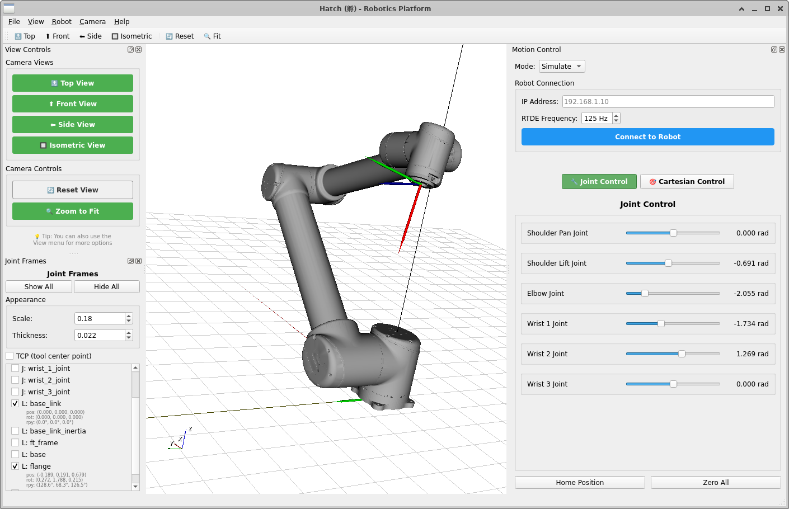
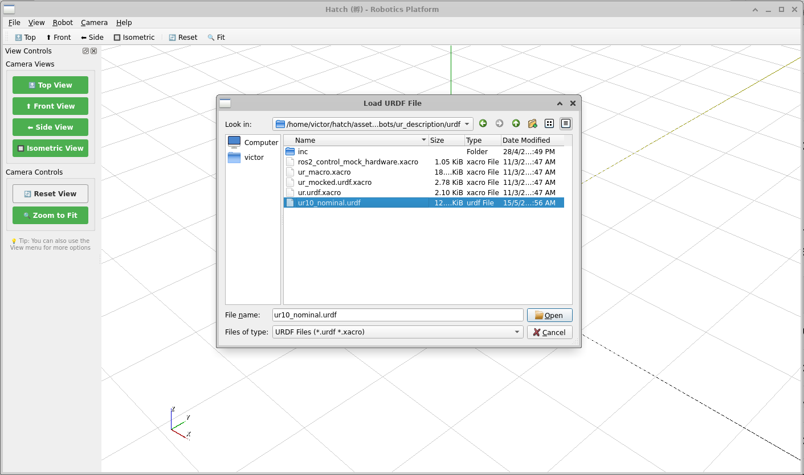
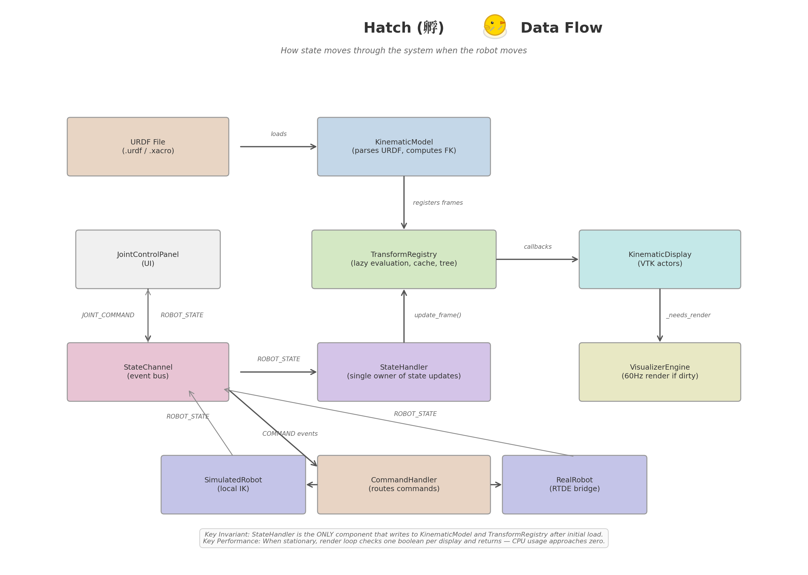

# Hatch (孵) 🐣


> An incubator for robotic ideas.
> One robot. One URDF. No polling.

[Quick Start](#quick-start-5-minutes) · [Documentation](#documentation) · [Architecture](architecture.md) · [Philosophy](philosophy.md)

---

## What It Looks Like



Hatch loads any URDF, solves IK in real time, and controls real hardware — all in a single process, without polling loops, and with direct VTK visualization.

## Quick Start (5 minutes)

**Recommended OS:** Ubuntu 20.04. Windows and macOS have not been tested.

```bash
git clone https://github.com/victorwu-robotics/hatch.git
cd hatch
python -m venv venv
source venv/bin/activate
pip install -r requirements.txt
python -m ui.main_window
```

**Load a robot:** File → Load URDF → select a `.urdf` or `.xacro` file.

**Move it:** Drag joint sliders — the 3D view updates in real time.

**Connect to hardware (optional):**
```bash
pip install ur-rtde  # for Universal Robots
# In Hatch: Robots → Connect → enter robot IP → switch to Real mode
# No program needed on the teach pendant — ur_rtde handles it automatically
```



## Architecture at a Glance

Three core abstractions everything else builds on:

| Abstraction | Purpose | File |
|-------------|---------|------|
| **TransformRegistry** | All spatial relationships, lazy-evaluated | `core/world_state/transform_registry.py` |
| **StateChannel** | All events, publish/subscribe, no polling | `core/world_state/state_channel.py` |
| **KinematicModel** | Pure Python URDF parsing + FK/IK | `core/kinematics/kinematic_model.py` |



## Principles (Summary)

These principles were discovered through derivation — each one demanded by a need that arose during development, not decreed in advance.

| # | Principle | Discovered From |
|---|-----------|---------------|
| 0 | Individuals Before Groups | Need: one robot, one session |
| 1 | Single Process, Single Memory Space | Need: no serialization overhead |
| 2 | Event-Driven, No Polling | Need: decoupled communication |
| 3 | Visualizer as Mind-Prying Tool | Need: see the robot's true state |
| 4 | Everything in URDF | Need: describe the scene |
| 5 | Space = TransformRegistry | Need: know where everything is |
| 6 | Time = StateChannel | Need: components must communicate |
| 7 | Movements as Models | Need: commands as data |
| 8 | Pure Python | Need: rapid development |
| 9 | UI Separate from Services | Need: controls without coupling |
| 10 | One Robot Per Session | Need: clean boundaries |

See [philosophy](philosophy.md) for the full derivation from first principles.

## Hardware Support

| Hardware | Status | Notes |
|----------|--------|-------|
| Simulated Robot | ✅ Full | IK solving, state publishing, no hardware needed |
| Universal Robots (UR) | ✅ Working | RTDE interface via `ur-rtde` |
| Orbbec Camera | ✅ Working | — |
| Keyence Laser Scanner | ✅ Working | — |
| RealSense Camera | 🔄 Planned | URDF-mounted, no point cloud yet |

## Documentation

| I want to... | Read this | Time |
|-------------|-----------|------|
| **Install Hatch and move my first robot** | [User Guide](user_guide.md) | 30 min |
| **Understand why Hatch exists** | [Philosophy](philosophy.md) | 10 min |
| **Understand how it works internally** | [Architecture](architecture.md) | 45 min |
| **Connect a robot, camera, or sensor** | [Integrating Hardware](integrating_hardware.md) | 30 min |
| **Read deep technical implementation notes** | [Technical Notes](technical_notes.md) | 20 min per section |
| **Fix a problem** | [User Guide → Troubleshooting](user_guide.md#troubleshooting) | 5 min |

---

*Hatch (孵) 🐣 — An incubator for robotic ideas. Version 1.0.0. MIT License.*
