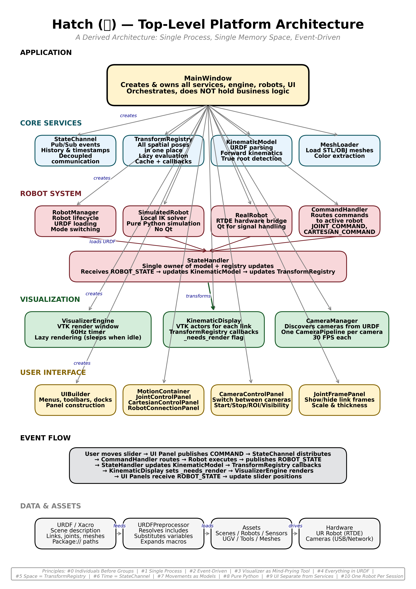

# Hatch (孵) 🐣



**A single-process, event-driven robotics platform for one robot arm.**

---

## For the Young Engineer

If you are about to use a robot arm for the first time, you are where I was. You have the hardware. You have the task. You do not yet have the mental model.

This is normal. This is correct. The mental model is not trivial.

Hatch is my attempt to give you what I did not have: a transparent space where every concept is visible, every movement is inspectable, and every decision is yours.

- **Move one joint at a time.** See the pose change. That is *joint space*.
- **Move the tool in XYZ.** See the joints solve. That is *Cartesian space* and *Inverse Kinematics*.
- **See the transform tree update in real time.** That is *knowing where everything is*.
- **See every configuration, every limit, every possibility.** That is *understanding before trusting*.

Use Hatch to learn. Then use whatever framework fits your production needs. The understanding you build here will serve you in any system.

[Hatch is pre-flight. The flight is yours.](#philosophy)

---

## Try Hatch in 5 Minutes

```bash
git clone https://github.com/victorwu-robotics/hatch.git
cd hatch
python -m venv venv
source venv/bin/activate
pip install -r requirements.txt
python -m ui.main_window
```

**File → Load URDF →** Select your robot's URDF or xacro file

[Full Getting Started Guide →](getting-started.md)

## What Hatch Is

| Principle |	What It Means |
|-----------|-----------------|
| Single Process | One Python process. One memory space. No distributed systems. |
| Event-Driven	No polling. | The timer is the only driver. |
| Everything in URDF | The scene description is the single source of truth. |
| Visualizer as Mind-Prying Tool | See every transform, every state, every decision. |
| UI Separate from Services | Panels publish events. They do not control.|

[Full Architecture →](architecture.md)

## Documentation Paths

| I want to... | Start here |
|--------------|------------|
| Try Hatch now | [Getting Started](getting-started.md) (30 min) |
| Understand the philosophy | [Philosophy](philosophy.md) (10 min summary, 2 hr deep) |
| Understand the architecture | [Architecture](architecture.md) (diagram + walkthrough) |
| Connect real hardware | [Integrating Hardware](integrating_hardware.md) |
| Extend Hatch | [API Reference](api_reference.md) |
| Read the story | [Technical Notes](technical_notes.md) |

## Principles

- Individuals before groups
- A single process, single memory space
- Event-driven, no polling
- The visualizer as a mind-prying tool — see everything, hide nothing
- Everything in URDF
- Space is the TransformRegistry
- Time is the StateChannel
- Movements are models
- Pure Python
- The UI separate from services
- One robot, one session