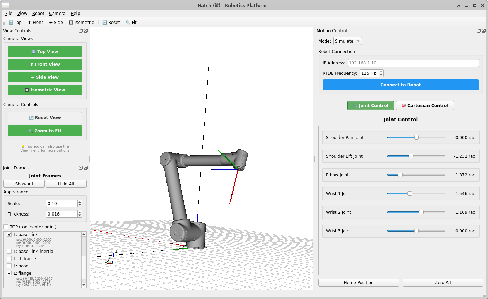

# Quick Start Guide

**Recommended OS:** Ubuntu 20.04. Windows and macOS have not been tested.

## 1. Instal and Run

```
git clone https://github.com/victorwu-robotics/hatch.git
cd hatch
python -m venv venv
source venv/bin/activate
pip install -r requirements.txt
python -m ui.main_window
```

You should see a white 3D view with a grid and coordinate axes.


## 2 Load a robot

Click **File → Load URDF ->**  select a ```.urdf``` or ```.xacro``` file.  

The robot appears in the 3D view


> **Meshes not showing?** See Troubleshooting below.

## 3 Move the robot

The **Motion Control** panel appears automatically.

- **Joint Control** tab: Drag sliders to move individual joints
- **Cartesian Control** tab: Move the TCP in X, Y, Z, RX, RY, RZ



The 3D view updates in real time as you drag.

## 4. Connect to a Real UR robot (optional)

   ```
   pip install ur-rtde
   ```

In Hatch: **Robots → Connect →** enter the robot's IP address -> switch to **Real** mode.

> **Safety:** Only **Real** mode sends commands to hardware.  
> Simulate modes move only the virtual robot.

## Troubleshooting (Top 3 Issues)

| Problem | Fix |
|---------|-----|
| Black screen / no 3D view | Check vtk and PyQt5 versions match requirements.txt. On Linux: export QT_QPA_PLATFORM=xcb. |
| Robot loads but no meshes | Use package:// paths in your URDF. Place meshes in the same directory as the URDF. |
| RTDE connection fails | Verify IP, check ports 30002 and 30004, press Stop on the teach pendant. |

---

## Next Steps

- [User Guide](user_guide.md) — full reference for daily use

- [Documentation Table of Contents](../DOCUMENTATION.md) — find the right doc for your goal

---

Hatch (孵) 🐣 — built to understand, built to see.
